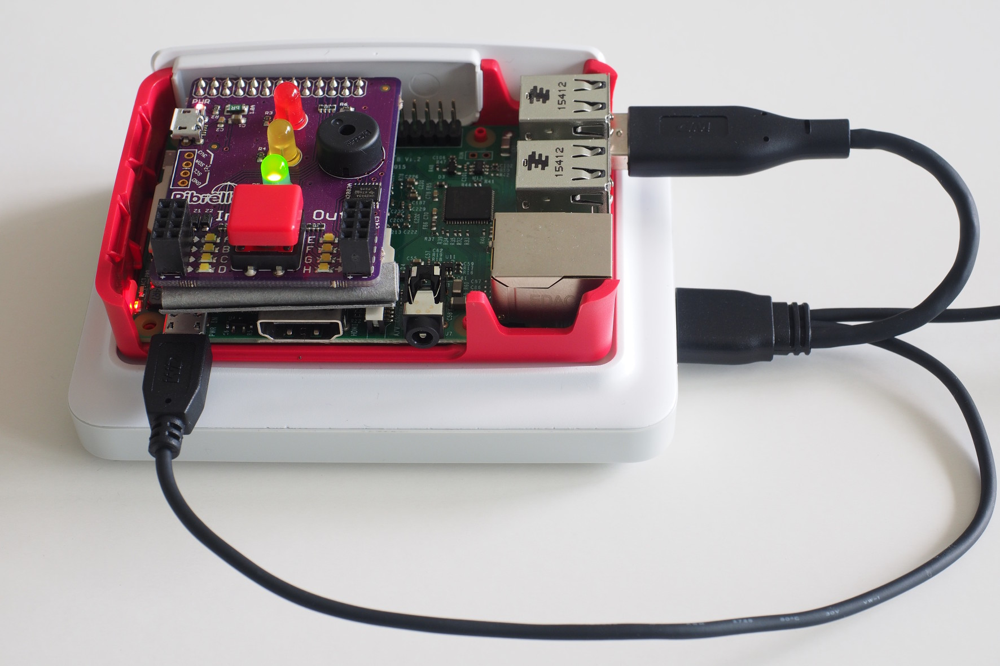
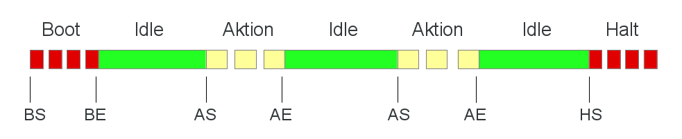

Raspberry Pi Imagetank
======================

What it is
----------

The imagetank is a backup solution for images based on a Raspberry Pi.
The basic idea is that you plug in your SD-card from your camera into the
Pi (using an USB adapter), and the Pi will automatically copy all
images to an attached HDD/SDD.

Since this is a headless system, the user interface has to be simple. The
imagetank uses an extension board called "Pibrella", which is
manufactured by Pimoroni. This board has a number of LEDs which we
use to signal state and a button, which we use for shutdown.

Installation
------------

First, install your system as described in
[Basic installation](./doc/basic_install.md "Basic installation"). This
sets up your system and your HDD/SDD.

Additionally install the following packages:

    sudo apt-get update
    sudo apt-get install rsync GraphicsMagick python-pip

### Install Pibrella support library ###

To install the python library for Pibrella run the following command:

    sudo pip install pibrella

### Install specific imagetank files ###

All necessary files are below the `files`-directory of this project.
To copy the files, clone the project and copy the files:

    sudo su -
    git clone https://github.com/bablokb/pi-imgtank.git
    cd pi-imgtank
    rsync -avz files/ /
    exit

This will install an udev-rule which will automatically call the
script `/usr/local/sbin/copy_img` on plugin of a SD-card. It will
also install two system-services which control the Pibrella-HAT.

To activate these system-services, run the following commands:

    sudo systemctl enable endofboot.servcie
    sudo systemctl enable hat-pibrella-service

There are two versions of the copy script: `copy_img` and `copy_img2`.
The first version does not change filenames while copying images,
**you therefore risk data-loss if you reset the image-numbers within
your camera or if you use multiple cameras which use the same
naming-scheme!** Make sure that `/etc/udev/rules.d/99-usbcopy.rules`
points to the correct script.

### Web access to your images ###

If you want to browse the images on the imagetank, you have to install
a webserver on the system. You can find the necessary instructions
in the document [Installing a Webserver](./doc/web_install.md 
"Installing a Webserver").

### Using the Imagetank as a Fileserver ###

The imagetank is meant as a backup solution. In case you need to recover
your files, a Samba-server comes in handy to access your images from
any computer within your network. You can find a setup instruction
[here](./doc/samba_install.md "Installing Samba").

Operation
---------

Now shut down and if not already done, install the Pibrella extension. If
you now reconnect power you should see the red led blinking for a few
seconds. After that, the red turns off and the green led turns on. The
system is now ready.

Insert a SDHC card from your digital camera into an USB-adapter and plug
it into the Pi. The orange led should now start to blink slowly. After all
files are copied, the led stops blinking and the green led comes on again.
Now it is safe to remove the USB-adapter.

The leds of the Pibrella hat always reflects the current state of the
system. You can see a  graphical representation of the various states in
the following image.

You can log into your system using ssh and see log-messages of the copy-script:

    sudo journalctl SYSLOG_IDENTIFIER=copy_img

or

    sudo journalctl SYSLOG_IDENTIFIER=copy_img2

(depending on which version of the copy-script you are using).

